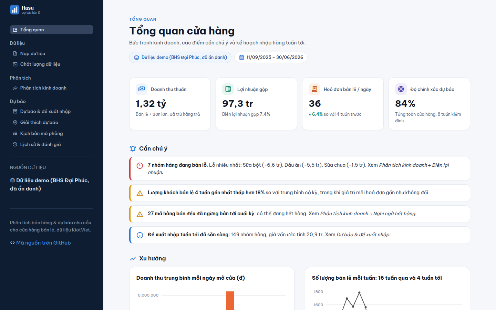
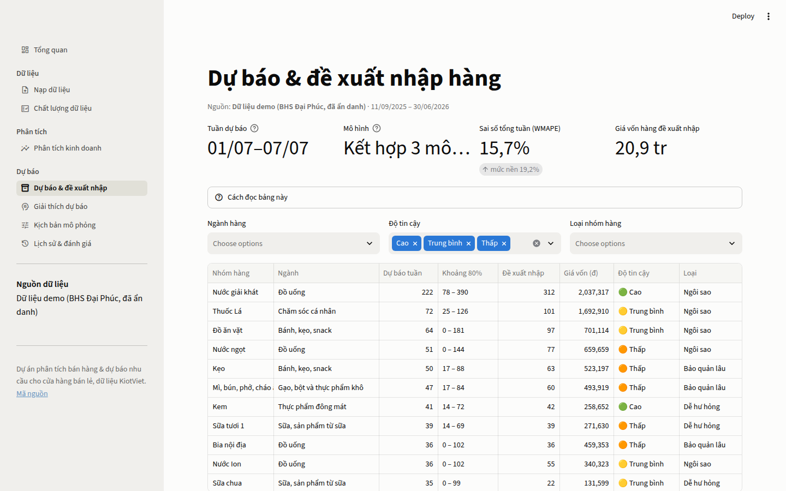
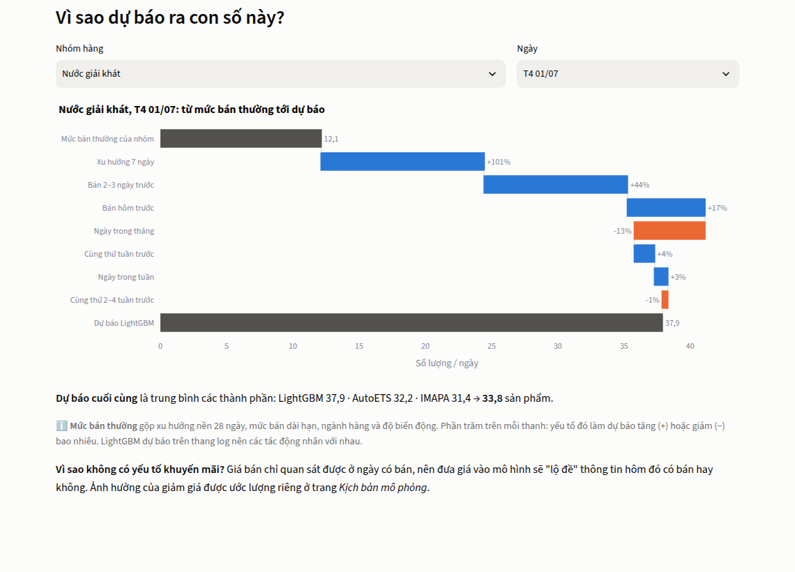
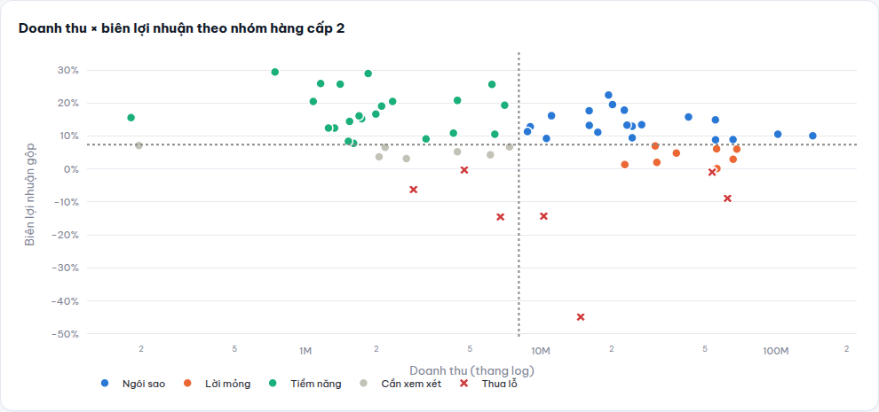
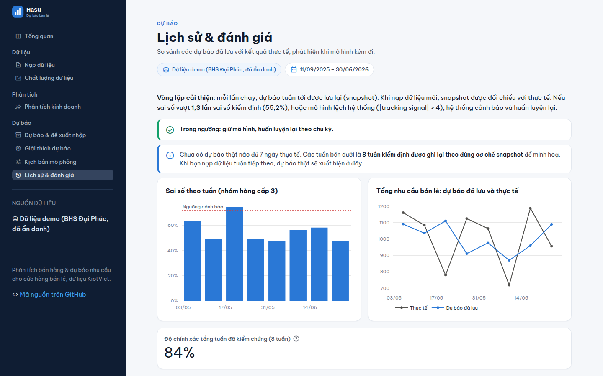

# Hasu-Tech: Phân tích bán hàng & dự báo nhu cầu cho cửa hàng bán lẻ

[](https://github.com/tnhvg/Hasu-Tech/actions/workflows/tests.yml)

Hệ thống nhận file xuất từ phần mềm bán hàng **KiotViet**, tự làm sạch dữ liệu, phân tích kinh doanh, dự báo nhu
cầu tuần tới theo nhóm hàng, đề xuất số lượng nhập kèm nhãn độ tin cậy, giải thích dự báo bằng SHAP, và tự đối
chiếu dự báo với thực tế khi có dữ liệu mới. Xây dựng trên dữ liệu thật của cửa hàng tạp hoá **BHS Đại Phúc**:
27.068 dòng giao dịch, 11/09/2025 – 30/06/2026.

**▶ Dùng thử ứng dụng: https://hasu-tech-qchbdh88vladebqzacagr8.streamlit.app** (dữ liệu demo đã ẩn danh)



## Bài toán kinh doanh

Chủ cửa hàng BHS Đại Phúc phải tự quyết định nhập hàng cho 2.521 mã thuộc 196 nhóm hàng mà chưa có công cụ dự báo nào hỗ trợ, trong khi 94% số mã chỉ phát sinh bán ra dưới 10% số ngày nên không thể nhẩm ra quy luật. Dữ liệu bán hàng hiện cũng không ghi nhận tồn kho, nên thiệt hại do nhập sai không được đo trực tiếp ở bất kỳ đâu.

Nhập thiếu thì mất doanh thu của lần khách hỏi mua, và có thể mất luôn khách sang cửa hàng khác. Nhập dư thì vốn nằm chết trong kho, hàng cận hạn phải đổi trả hoặc bán tháo, và với nhóm hàng có hạn sử dụng ngắn thì phần dư gần như mất trắng.

Dự án xây dựng mô hình dự báo nhu cầu theo nhóm hàng cấp 3, phân tầng theo mức độ đầy đủ dữ liệu, để trả lời một câu hỏi cụ thể mà chủ cửa hàng phải quyết mỗi tuần: tuần tới nhóm hàng nào cần nhập, với số lượng bao nhiêu.

Thành công được đo bằng ba chỉ tiêu:

1. **WMAPE so với mức nền.** Mức nền là dự báo bằng trung bình lịch sử. Chọn WMAPE vì dữ liệu có rất nhiều ngày bán bằng 0: MAPE chia cho lượng bán từng ngày nên không tính được, còn WMAPE chia cho tổng lượng bán cả kỳ nên luôn xác định.
2. **Tỷ lệ nhóm hàng đủ dữ liệu có WMAPE cải thiện so với mức nền**, để tránh trường hợp con số tổng đẹp nhờ vài nhóm lớn trong khi phần lớn nhóm còn lại tệ đi. Nhóm quá thưa được báo cáo riêng, không tính vào tỷ lệ này.
3. **Mô phỏng nhập hàng trên 8 tuần cuối.** So sánh số ngày thiếu hàng và lượng hàng dư ước tính khi nhập theo dự báo với khi nhập theo trung bình lịch sử. Đây là kết quả mô phỏng trên dữ liệu quá khứ, không phải kết quả áp dụng thực tế tại cửa hàng.

## Kết quả

| Chỉ tiêu (8 tuần kiểm định, đơn vị tuần) | Mô hình | Mức nền |
|---|---|---|
| WMAPE toàn cửa hàng | **15,7%** (chính xác ~84%) | 19,2% |
| WMAPE ngành hàng cấp 1 | **24,1%** | 39,1% |
| WMAPE nhóm hàng cấp 3 | **55,2%** | 72,6% |
| Tỷ lệ nhóm hàng có sai số thấp hơn mức nền | 50% | – |
| Mô phỏng nhập hàng: lượng hàng thiếu / giá trị hàng dư | **−11% / −20%** | – |

**Nói thẳng về giới hạn:** ở cấp nhóm hàng nhỏ theo tuần, nhu cầu gần như ngẫu nhiên. Mô hình chỉ tốt hơn trung
bình trượt 28 ngày một chút (55,2% so với 57,9%) và chỉ thắng mức nền ở một nửa số nhóm. Giá trị thực tế nằm ở dự
báo cấp cao đáng tin, chính sách nhập hàng theo phân vị, và khả năng giải thích, tự động hoá. Chi tiết trong
[báo cáo mô hình](docs/forecast_report.md).

### Phát hiện kinh doanh nổi bật ([báo cáo đầy đủ](docs/business_analysis.md))

- **1,8% số hoá đơn (đơn lớn, đơn công ty) mang về 36% doanh thu**, biên lợi nhuận 5,6% so với 8,4% của bán lẻ.
  Đây là một kênh riêng, cần kế hoạch nhập và giá sỉ riêng.
- **Lượng khách bán lẻ giảm 26% từ tháng 5/2026 (từ 47 xuống 34 hoá đơn/ngày)** trong khi giá trị mỗi hoá đơn không đổi: vấn đề nằm ở lưu lượng khách.
- **7 nhóm hàng bán lỗ**, tập trung ở sữa và dầu ăn. Riêng một mã dầu ăn bán thấp hơn giá vốn ghi nhận khoảng 29%.
- **Tết: doanh thu ×1,76 nhưng số lượng chỉ ×1,13.** Nhập hàng Tết theo hệ số doanh thu sẽ dư gần gấp rưỡi.
- **Bật lửa bị xếp nhầm vào "dụng cụ bếp"**, và là món mua kèm thuốc lá mạnh nhất (lift 8,5).

| | |
|---|---|
|  |  |
|  |  |

## Cách tiếp cận

```
File Excel KiotViet ─► raw ─► staging ─► mart ─► phân tích (FP-Growth, nghi ngờ hết hàng)
                       │       │          │
                       │       │          └► dự báo: kiểm định trượt 12 tuần ─► đề xuất nhập ─► snapshot
                       │       └ làm sạch, gắn cờ, ẩn danh người bán                               │
                       └ đổi tên cột, ép kiểu, không sửa giá trị          dữ liệu tuần mới ─► đối chiếu, drift
```

| Bước | Điểm chính |
|---|---|
| **Làm sạch** (`sql/staging`) | Khử trùng lặp theo mã HĐ + thời gian + mã hàng; tính lại doanh thu mức dòng (khớp KiotViet tới 6 đ/tháng); điền giá vốn thiếu; sửa cây nhóm hàng; tách **đơn lớn / đơn tổ chức / xuất nội bộ** khỏi nhu cầu bán lẻ; ẩn danh người bán |
| **Lịch** (`dim_date`) | Ngày đóng cửa (Tết, lễ) không bị coi là nhu cầu bằng 0 |
| **Phân tích** (`sql/marts`, `analysis.py`) | Xu hướng theo ngày mở cửa, ABC theo số lượng, giờ × thứ, ma trận doanh thu × biên, hệ số Tết theo số lượng và doanh thu, FP-Growth trên dữ liệu đã loại khuyến mãi, phát hiện nghi ngờ hết hàng bằng xác suất |
| **Dự báo** (`forecasting/`) | Lớp ngày thường + lớp ngày lễ; phân loại nhu cầu **Syntetos–Boylan**; 8 mô hình StatsForecast (Croston, ADIDA, IMAPA, TSB, AutoETS...) + **LightGBM toàn cục** + 3 mô hình kết hợp (+ **Chronos-Bolt** tuỳ chọn); chọn mô hình trên 4 tuần, chấm trên 8 tuần khác |
| **Quyết định** (`policy.py`) | Khoảng dự báo **conformal**; phân vị τ theo loại nhóm hàng (ngôi sao 0,80 · bảo quản lâu 0,70 · dễ hư 0,55), nối phân tích biên lợi nhuận với mô hình |
| **Giải thích** | SHAP cho LightGBM, quy đổi thành "% tác động" |
| **Vòng lặp** (`monitor.py`) | Lưu snapshot dự báo; khi có dữ liệu mới thì đối chiếu, tính WMAPE / bias / tracking signal, cảnh báo drift và tự huấn luyện lại |

**Công nghệ:** Python · DuckDB (SQL) · pandas · StatsForecast · MLForecast · LightGBM · SHAP · mlxtend · Streamlit · Plotly · pytest · GitHub Actions

## Ứng dụng web

8 màn hình: **Tổng quan** · **Nạp dữ liệu** (tự nhận diện cột theo từ điển KiotViet + từ điển đồng nghĩa, người dùng
xác nhận; ghép dữ liệu mới và khử trùng lặp) · **Chất lượng dữ liệu** · **Phân tích kinh doanh** · **Dự báo & đề xuất
nhập** (nhãn độ tin cậy, phân bổ xuống mã hàng, tải CSV) · **Giải thích dự báo** · **Kịch bản mô phỏng** (giảm giá có
tính triệt tiêu chéo, kỳ nghỉ Tết) · **Lịch sử & đánh giá**.

Bản công khai dùng **dữ liệu demo đã ẩn danh** (`app/demo_data/`): chỉ gồm bảng tổng hợp và kết quả mô hình.
`python -m hasu.export_demo` từ chối xuất nếu bảng chứa tên nhân viên, ghi chú hay mã hoá đơn. Dữ liệu gốc không
bao giờ được đưa lên repo.

## Chạy trên máy

```bash
pip install -e ".[dev]"
# đặt file Excel "Báo cáo bán hàng theo lợi nhuận" xuất từ KiotViet vào data/raw/
python -m hasu.pipeline          # nạp, làm sạch, tổng hợp, báo cáo chất lượng
python -m hasu.business_report   # báo cáo phân tích kinh doanh + biểu đồ
python -m hasu.forecasting.run   # kiểm định, dự báo 28 ngày, đề xuất nhập, SHAP (~1 phút)
python -m hasu.forecast_report   # báo cáo mô hình dự báo
streamlit run app/streamlit_app.py
pytest                           # 25 bài kiểm thử
```

Không có file KiotViet? Chạy thẳng `streamlit run app/streamlit_app.py`, ứng dụng sẽ dùng dữ liệu demo.
Triển khai lên Streamlit Cloud: xem [hướng dẫn](docs/huong_dan_trien_khai.md).

## Cấu trúc thư mục

```
data/raw/            dữ liệu gốc (không đưa lên GitHub)
data/processed/      CSDL DuckDB sinh ra (không đưa lên GitHub)
sql/staging/         làm sạch: stg_sales_lines, dim_date
sql/marts/           bảng tổng hợp cho phân tích và dự báo
src/hasu/            ingest, pipeline, quality, analysis, báo cáo
src/hasu/forecasting data, models, evaluate, policy, monitor, run
app/                 ứng dụng Streamlit + dữ liệu demo
tests/               kiểm thử: nạp, làm sạch, chỉ số, phân loại nhu cầu, drift
docs/                báo cáo, biểu đồ, ảnh chụp, hướng dẫn, mockup, kịch bản thuyết trình
```

## Giới hạn và hướng phát triển

| Giới hạn | Hướng xử lý |
|---|---|
| 10 tháng dữ liệu, một kỳ Tết | Dự báo 7–28 ngày; hệ số Tết cập nhật qua vòng lặp |
| Không có dữ liệu tồn kho, thời gian giao hàng | Cần bổ sung để tính tồn kho an toàn; đề xuất hiện chưa trừ tồn |
| Hết hàng chỉ suy đoán từ dữ liệu bán | Danh sách để chủ cửa hàng xác nhận |
| Ảnh hưởng giảm giá lẫn với mua theo thùng | Kịch bản giảm giá hiển thị như mức trần, kèm cảnh báo |
| Chưa chạy được Chronos (mạng môi trường thử nghiệm chặn Hugging Face) | Code sẵn sàng: `pip install -e ".[chronos]"` |
| Một cửa hàng, chưa có đăng nhập | Mở rộng: tài khoản riêng từng doanh nghiệp, mô hình toàn cục đa cửa hàng |

## Tài liệu

[Báo cáo phân tích kinh doanh](docs/business_analysis.md) · [Báo cáo mô hình dự báo](docs/forecast_report.md) ·
[Báo cáo chất lượng dữ liệu](docs/data_quality_report.md) · [Hướng dẫn triển khai](docs/huong_dan_trien_khai.md) ·
[Mockup với Google Stitch](docs/mockup_google_stitch.md) · [Kịch bản thuyết trình](docs/kich_ban_thuyet_trinh.md)
