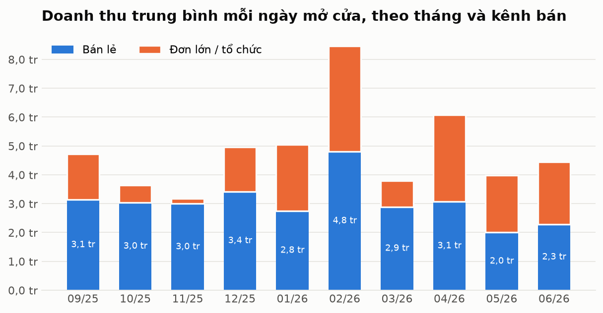
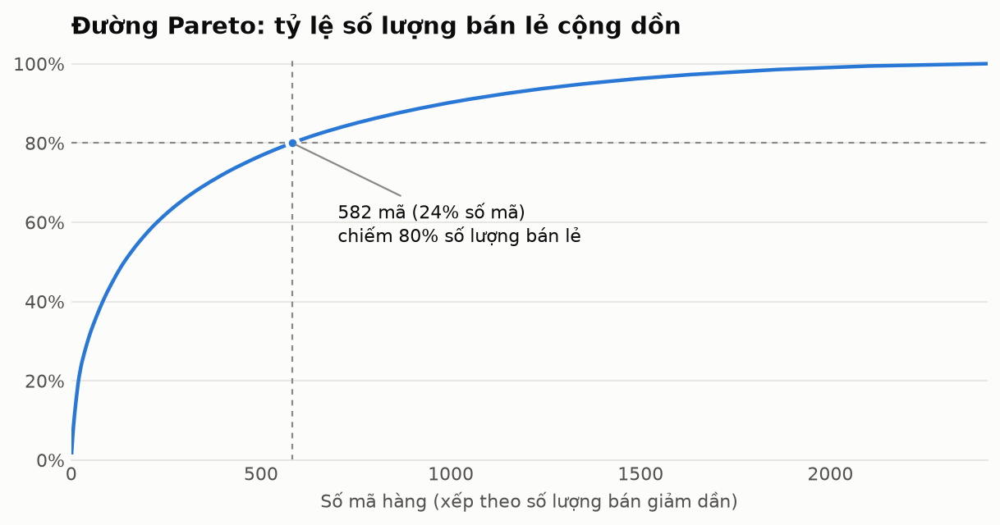
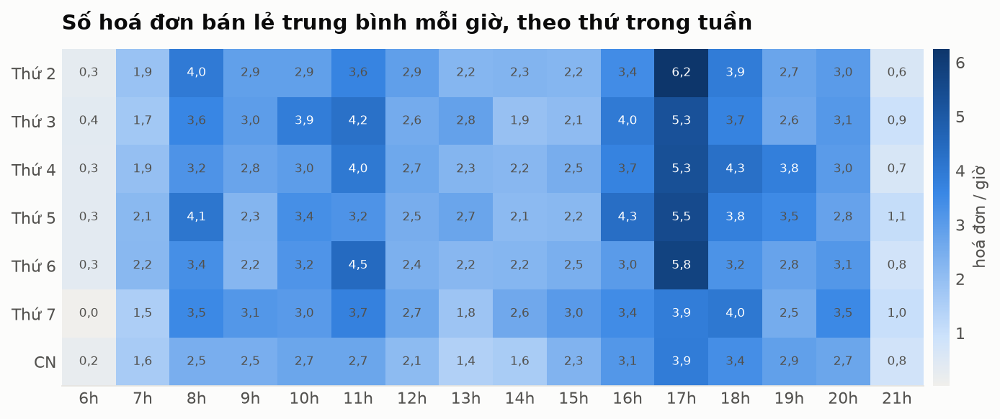
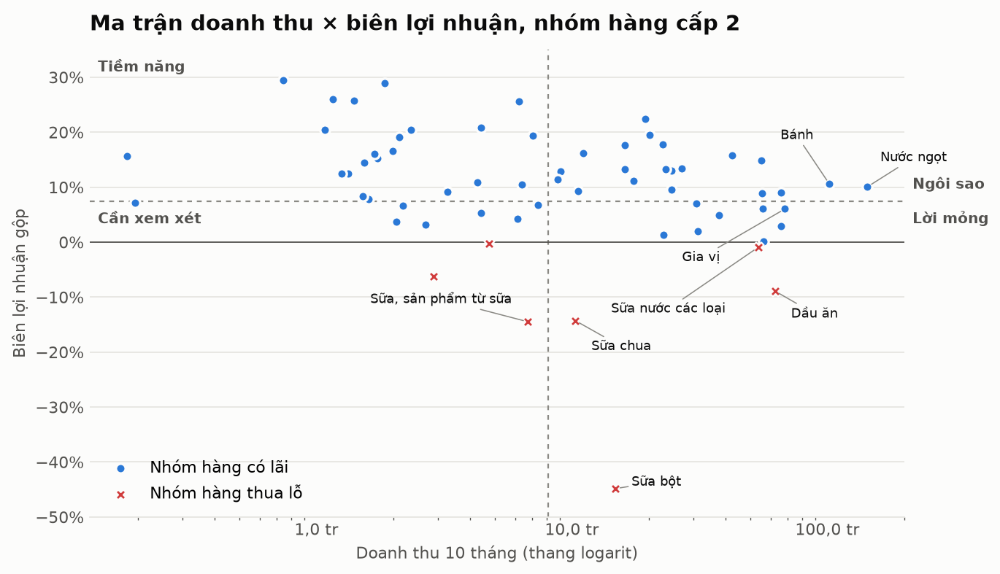
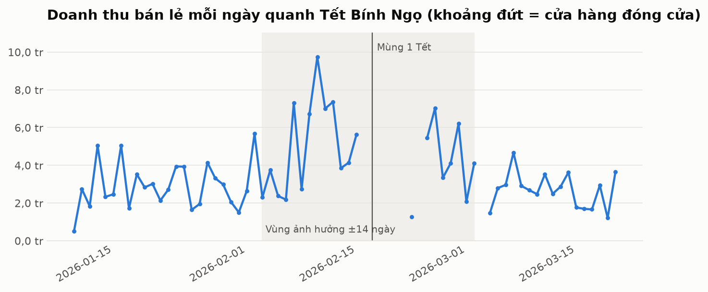

# Phân tích kinh doanh — Cửa hàng BHS Đại Phúc

_Sinh tự động bởi `python -m hasu.business_report` lúc 02/10/2026 10:31. Dữ liệu: 11/09/2025 – 30/06/2026. Mọi con số được truy vấn trực tiếp từ dữ liệu đã làm sạch (xem [báo cáo chất lượng dữ liệu](data_quality_report.md))._

**Nguyên tắc đo lường:** quyết định vận hành và tồn kho (nhập bao nhiêu, xếp ca) dùng **số lượng** và **số hoá đơn**; quyết định tài chính (định giá, chọn nhóm hàng) dùng **doanh thu** và **lợi nhuận**.

## Tóm tắt cho chủ cửa hàng

1. **Đơn lớn chỉ chiếm 1,8% số hoá đơn nhưng mang về 36% doanh thu**, với biên lợi nhuận 5,6% (bán lẻ: 8,4%). Đây là một kênh bán riêng, cần được quản lý và dự báo riêng.
2. **Lượng khách bán lẻ giảm rõ trong tháng 5–6/2026**: từ khoảng 79 hoá đơn/ngày xuống 58 hoá đơn/ngày (-27%), trong khi giá trị mỗi hoá đơn gần như không đổi (38.638 đ → 37.244 đ). Nguyên nhân là **ít khách hơn**, không phải khách mua ít đi.
3. **7 nhóm hàng đang bán lỗ**, tập trung ở dầu ăn và các sản phẩm từ sữa. Riêng HASUKOOK dầu đậu nành NK Nga can 5L/3 (Can) được bán khoảng 200.000 đ trong khi giá vốn ghi nhận 280.000 đ, lỗ 5,6 triệu đ. Cần kiểm tra lại giá vốn hoặc giá bán.
4. **Tết làm tăng doanh thu bán lẻ 1,76 lần nhưng số lượng chỉ tăng 1,13 lần** trong 14 ngày trước Tết: khách mua hàng đắt hơn (quà biếu, thùng nước, bánh kẹo hộp) chứ không mua nhiều món hơn hẳn.
5. **Cao điểm lúc 17h** (5,1 hoá đơn/giờ), thấp điểm 14h–15h. Chủ nhật vắng nhất (36 hoá đơn/ngày so với 45 các ngày khác).

## 1. Xu hướng doanh thu và lợi nhuận

Biểu đồ dùng **doanh thu trung bình mỗi ngày mở cửa** thay cho tổng tháng, vì tháng 09/2025 chỉ có dữ liệu từ ngày 11 và tháng 02/2026 nghỉ Tết 7 ngày. So tổng tháng sẽ cho kết luận sai.

| Tháng | Bán lẻ / ngày | Biên bán lẻ | Đơn lớn / ngày | Hoá đơn bán lẻ / ngày | Giá trị / hoá đơn |
|---|---|---|---|---|---|
| 2025-09 | 3,1 triệu đ | 10,9% | 1,6 triệu đ | 74 | 42.850 đ |
| 2025-10 | 3,0 triệu đ | 12,1% | 0,6 triệu đ | 86 | 35.448 đ |
| 2025-11 | 3,0 triệu đ | 10,5% | 0,2 triệu đ | 89 | 33.732 đ |
| 2025-12 | 3,4 triệu đ | 7,0% | 1,5 triệu đ | 89 | 38.670 đ |
| 2026-01 | 2,8 triệu đ | 9,8% | 2,3 triệu đ | 73 | 37.777 đ |
| 2026-02 | 4,8 triệu đ | 4,6% | 3,7 triệu đ | 78 | 61.777 đ |
| 2026-03 | 2,9 triệu đ | 2,9% | 0,9 triệu đ | 73 | 40.085 đ |
| 2026-04 | 3,1 triệu đ | 5,5% | 3,0 triệu đ | 73 | 41.901 đ |
| 2026-05 | 2,0 triệu đ | 11,5% | 2,0 triệu đ | 56 | 36.251 đ |
| 2026-06 | 2,3 triệu đ | 11,7% | 2,1 triệu đ | 60 | 38.236 đ |

**Nhận xét.** Doanh thu bán lẻ ổn định quanh 3,0 triệu đ/ngày từ tháng 9 đến tháng 4 (trừ tháng Tết), rồi giảm còn 2,1 triệu đ/ngày trong tháng 5–6. Số hoá đơn mỗi ngày giảm tương ứng trong khi giá trị mỗi hoá đơn không đổi, nên sụt giảm đến từ **lượng khách**. Dữ liệu bán hàng không cho biết lý do (mùa hè, đối thủ mới, thay đổi giờ mở cửa...): **cần chủ cửa hàng xác nhận**.

Biên lợi nhuận bán lẻ tụt thấp trong tháng 2–4/2026. Các khoản lỗ lớn nhất trong giai đoạn này nằm ở giặt giũ (tháng 2), thực phẩm ăn liền (tháng 3–4) và sữa chua: phù hợp với việc bán xả hàng cận hạn hoặc giá vốn nhập tăng mà giá bán chưa điều chỉnh.

## 2. Phân loại ABC theo số lượng bán lẻ

| Nhóm | Số mã | Tỷ lệ số mã | Tỷ lệ số lượng | Tỷ lệ doanh thu bán lẻ | Trung vị % ngày có bán |
|---|---|---|---|---|---|
| A | 582 | 24,1% | 80,0% | 54,5% | 6,4% |
| B | 778 | 32,2% | 15,0% | 28,1% | 2,5% |
| C | 1.054 | 43,7% | 5,0% | 17,4% | 0,7% |

**Nhận xét.** 582 mã hàng nhóm A (24% số mã) chiếm 80% số lượng bán lẻ. Tuy vậy, ngay cả trong nhóm A, trung vị mỗi mã chỉ bán ra ở 6% số ngày. Vì vậy dự báo cho **từng mã** theo ngày vẫn rất nhiễu, và mô hình sẽ dự báo ở **cấp nhóm hàng** trước.

| # | Mã hàng | Số lượng | % ngày có bán |
|---|---|---|---|
| 1 | Nước khoáng Lavie 0.35L (Chai) | 987 | 17,4% |
| 2 | Hảo hảo hương vị mì tôm chua cay 75G/30 - gói (Gói) | 809 | 28,1% |
| 3 | Thuốc lá Thăng Long Mềm (Bao) | 745 | 74,0% |
| 4 | Nước khoáng Lavie 0.5L (Chai) | 729 | 29,2% |
| 5 | Sài gòn dưa lưới (Bao) | 711 | 70,1% |
| 6 | Nước I - on Mira 360ml (Chai) | 609 | 9,6% |
| 7 | Nước Mira pH9 550ml (Chai) | 571 | 30,6% |
| 8 | Nước tăng lực Redbull (Lon) | 540 | 65,5% |
| 9 | Bia lon Saigon Lager 330ml (Lon) | 505 | 19,6% |
| 10 | Trứng gà 10 quả (Quả) | 499 | 8,5% |

## 3. Mẫu hình theo giờ và thứ

- **Ba khung cao điểm**: 17h (cao nhất), 18h và 11h, trùng giờ đi làm về, giờ đi làm buổi sáng và trước bữa trưa.
- **Thấp điểm** 14h–15h (2,3 hoá đơn/giờ).
- **Chủ nhật** vắng hơn rõ rệt (36 hoá đơn/ngày).

**Khuyến nghị xếp ca:** bố trí đủ người đứng quầy 16h–19h và 7h–9h; dùng khung 13h–15h để nhận hàng, kiểm kho, sắp xếp kệ.

## 4. Biên lợi nhuận theo nhóm hàng

Hai đường chia: doanh thu trung vị giữa các nhóm (8,1 triệu đ) và biên lợi nhuận chung của cửa hàng (7,4%).

| Phân nhóm | Số nhóm hàng | Tỷ trọng doanh thu | Lợi nhuận gộp |
|---|---|---|---|
| Ngôi sao | 20 | 54,2% | 87,4 triệu đ |
| Lời mỏng | 8 | 27,9% | 14,5 triệu đ |
| Tiềm năng | 22 | 4,2% | 9,5 triệu đ |
| Cần xem xét | 7 | 1,9% | 1,3 triệu đ |
| Thua lỗ | 7 | 11,8% | -15,3 triệu đ |

**Nhóm thua lỗ:**

| Nhóm hàng | Doanh thu | Lợi nhuận gộp | Biên |
|---|---|---|---|
| Sữa bột | 14,8 triệu đ | -6,6 triệu đ | -44,8% |
| Dầu ăn | 62,3 triệu đ | -5,5 triệu đ | -8,9% |
| Sữa chua | 10,3 triệu đ | -1,5 triệu đ | -14,3% |
| Sữa, sản phẩm từ sữa | 6,7 triệu đ | -1,0 triệu đ | -14,5% |
| Sữa nước các loại | 53,6 triệu đ | -0,5 triệu đ | -1,0% |
| Nui, mì, bún khô | 2,9 triệu đ | -0,2 triệu đ | -6,2% |
| Rau, củ | 4,7 triệu đ | -0,0 triệu đ | -0,3% |

**Nhận xét.**

- 20 nhóm "ngôi sao" (nước ngọt, bánh, trà, snack, thuốc lá...) tạo 54% doanh thu với biên cao hơn mức chung: đây là nhóm cần **không bao giờ để hết hàng**.
- 8 nhóm "lời mỏng" như gia vị, vệ sinh nhà cửa, giặt giũ chiếm 28% doanh thu nhưng biên rất thấp, phần lớn do bán theo đơn lớn. Nên xem lại giá bán sỉ cho các nhóm này.
- Toàn bộ ngành **sữa** đang lỗ hoặc gần hoà vốn (sữa bột biên -44,8%). Sữa có hạn dùng ngắn, nên khả năng cao là xả hàng cận hạn. Đây chính là nhóm cần dự báo sát nhất để giảm hàng dư.
- **Hạn chế:** giá vốn lấy từ KiotViet tại thời điểm bán. Nếu giá vốn nhập sai (ví dụ nhập theo thùng nhưng bán theo chai), biên sẽ sai. Các nhóm thua lỗ cần chủ cửa hàng đối chiếu hoá đơn nhập.

## 5. Ảnh hưởng của Tết

| Giai đoạn | Số ngày mở cửa | Hệ số số lượng | Hệ số doanh thu |
|---|---|---|---|
| Trước Tết | 13 | 1,13 lần | 1,76 lần |
| Sau Tết | 8 | 1,14 lần | 1,47 lần |

Hệ số = trung bình mỗi ngày mở cửa trong giai đoạn / trung bình các ngày mở cửa ngoài vùng ±14 ngày.

**Nhóm hàng tăng mạnh nhất 14 ngày trước Tết (theo doanh thu):**

| Nhóm hàng cấp 1 | Hệ số doanh thu | Hệ số số lượng |
|---|---|---|
| Thủ công | 34,84 lần | 2,31 lần |
| Bánh, kẹo, snack | 3,26 lần | 1,41 lần |
| Đồ uống | 2,27 lần | 1,55 lần |
| Gạo, bột và thực phẩm khô | 1,52 lần | 0,91 lần |
| Chăm sóc nhà cửa | 1,48 lần | 1,39 lần |
| Chăm sóc cá nhân | 0,90 lần | 1,08 lần |

**Nhận xét.** Trước Tết, doanh thu tăng mạnh hơn nhiều so với số lượng. Điều này khẳng định nguyên tắc dùng đúng thước đo: nếu nhập hàng Tết theo hệ số doanh thu 1,76 lần, cửa hàng sẽ nhập dư gần gấp rưỡi so với nhu cầu thực tế về số lượng. Với dự báo nhập hàng, dùng **hệ số số lượng theo từng nhóm hàng**. **Giới hạn:** dữ liệu chỉ có một kỳ Tết, nên các hệ số này là một lần quan sát và sẽ được cập nhật khi có thêm dữ liệu.

## 6. Phân tích giỏ hàng

Thuật toán FP-Growth (cùng kết quả với Apriori, chạy nhanh hơn) trên 4.651 hoá đơn bán lẻ có từ 2 nhóm hàng trở lên, **đã loại các dòng bán dưới giá phổ biến** để luật phản ánh hành vi mua tự nhiên chứ không phải tác động của khuyến mãi. Phân tích ở cấp nhóm hàng 3 vì từng mã hàng quá thưa.

- **Độ tin cậy (confidence)**: trong các hoá đơn có A, bao nhiêu % có cả B.
- **Lift**: khả năng mua B khi đã mua A cao gấp bao nhiêu lần so với bình thường. Lift > 1 là có liên kết.

| Nếu mua | Thì thường mua | Số hoá đơn | Độ tin cậy | Lift |
|---|---|---|---|---|
| Dụng cụ bếp khác | Thuốc Lá | 65 | 77,4% | 8,43 |
| Mì ăn liền | Mì, bún, phở, cháo ăn liên, bánh gạo | 163 | 53,4% | 2,99 |
| Kẹo Tổng Hợp | Kẹo | 87 | 43,3% | 2,79 |
| Trà, Cà phê, cacao | Thuốc Lá | 48 | 22,5% | 2,45 |
| Lạp xưởng, xúc xích ăn liền | Mì, bún, phở, cháo ăn liên, bánh gạo | 190 | 43,0% | 2,41 |
| Bánh, kẹo, snack | Snack các loại | 64 | 31,8% | 2,29 |
| Snack Bim bim | Snack các loại | 121 | 30,2% | 2,17 |
| Mì ăn liền | Lạp xưởng, xúc xích ăn liền | 57 | 18,7% | 1,97 |
| Thuốc Lá | Nước giải khát | 226 | 52,9% | 1,67 |
| Trà, Cà phê, cacao | Nước giải khát | 102 | 47,9% | 1,51 |

**Đọc kết quả cẩn thận:** một số luật có lift cao nhưng thực chất là **cùng một loại hàng bị chia làm hai nhóm** trong KiotViet: `Mì ăn liền` và `Mì, bún, phở, cháo ăn liền`, `Kẹo Tổng Hợp` và `Kẹo`, `Snack Bim bim` và `Snack các loại`. Đây là dấu hiệu cây nhóm hàng cần gộp lại, không phải hành vi mua kèm. Các khuyến nghị dưới đây chỉ dựa trên những cặp khác loại hàng.

**Khuyến nghị combo và bày kệ:**

- `Dụng cụ bếp khác → Thuốc lá` có lift cao nhất. Kiểm tra cho thấy nhóm này thực chất là **bật lửa**, bị xếp nhầm nhóm hàng. Nên chuyển bật lửa về cạnh quầy thuốc lá, đồng thời sửa nhóm hàng trong KiotViet.
- **Mì + xúc xích/lạp xưởng ăn liền**: combo "bữa ăn nhanh". Đặt hai nhóm cạnh nhau, hoặc bán kèm giá combo.
- **Thuốc lá + nước giải khát**, **trà/cà phê + nước giải khát**: đặt tủ nước gần quầy thu ngân.
- **Sữa tươi + bánh**: combo bữa sáng cho khung 7h–9h.

## 7. Nghi ngờ hết hàng (nhu cầu không được đáp ứng)

Xét 81 mã hàng bán đều (có bán ở ≥ 15% số ngày mở cửa). Với mỗi mã, nếu một chuỗi ngày mở cửa liên tiếp không bán được có xác suất xảy ra ngẫu nhiên dưới 1%, chuỗi đó bị đánh dấu nghi ngờ hết hàng.

- **72/81 mã** có ít nhất một giai đoạn nghi ngờ, tổng cộng 129 giai đoạn.
- **27 mã** ngừng bán hẳn tới cuối kỳ dữ liệu: hoặc đang hết hàng, hoặc đã ngừng kinh doanh.

| Mã hàng | Từ | Đến | Số ngày mở cửa không bán | % ngày có bán (bình thường) | Đánh giá |
|---|---|---|---|---|---|
| Bánh da trứng cuộn kem tươi chà bông 84g (Gói) | 25/12/2025 | 30/06/2026 | 176 | 18,9% | Không bán tới cuối kỳ: hết hàng hoặc đã ngừng bán |
| Kẹo sing-gum CAME ly 150 gói 2 viên (Cái) | 05/01/2026 | 19/06/2026 | 154 | 18,5% | Nghi ngờ hết hàng |
| Bánh mỳ chà bông Staff 60g/60 (Gói) | 28/01/2026 | 30/06/2026 | 142 | 27,2% | Không bán tới cuối kỳ: hết hàng hoặc đã ngừng bán |
| Muối chấm hảo hảo tôm chua cay 120g/24h (Lọ) | 08/03/2026 | 30/06/2026 | 111 | 16,7% | Không bán tới cuối kỳ: hết hàng hoặc đã ngừng bán |
| Nước 7 up Rivive 500ml/24 (Chai) | 02/03/2026 | 17/06/2026 | 103 | 15,7% | Nghi ngờ hết hàng |
| Kem MOCHI (Cái) | 26/12/2025 | 06/04/2026 | 94 | 16,4% | Nghi ngờ hết hàng |
| Nước trà xanh C2 hương chanh 455ml/24 (Chai) | 04/04/2026 | 30/06/2026 | 84 | 31,0% | Không bán tới cuối kỳ: hết hàng hoặc đã ngừng bán |
| Cà Phê Sữa Đá Highlands BÉ (185ml/Lon) (Lon) | 03/12/2025 | 26/02/2026 | 79 | 22,8% | Nghi ngờ hết hàng |
| Kẹo Mút CC Hỗn Hợp 18Gói x 558g (60v) (Cái) | 09/04/2026 | 30/06/2026 | 79 | 23,6% | Không bán tới cuối kỳ: hết hàng hoặc đã ngừng bán |
| Nước hồng trà C2 vị đào chai 455ml/24 (Chai) | 14/04/2026 | 30/06/2026 | 75 | 24,5% | Không bán tới cuối kỳ: hết hàng hoặc đã ngừng bán |

**Hệ quả cho mô hình:** các giai đoạn này là **dữ liệu bị kiểm duyệt** (censored), tức nhu cầu có nhưng không bán được vì không có hàng, chứ không phải nhu cầu bằng 0. Khi dự báo ở cấp nhóm hàng, khách thường mua mã khác trong cùng nhóm, nên ảnh hưởng nhỏ hơn nhiều so với cấp mã hàng.

**Giới hạn:** đây là suy đoán từ dữ liệu bán. Hàng theo mùa (ví dụ kem vào mùa đông) và hàng ngừng kinh doanh cũng có biểu hiện giống hệt. Danh sách đầy đủ có trong ứng dụng để chủ cửa hàng xác nhận từng trường hợp.

## Khuyến nghị tổng hợp

| # | Khuyến nghị | Căn cứ | Ưu tiên |
|---|---|---|---|
| 1 | Đối chiếu giá vốn và giá bán các mã đang bán dưới giá vốn, bắt đầu với dầu ăn HASUKOOK và sữa bột | Mục 4: 7 nhóm hàng lỗ | Cao |
| 2 | Tìm hiểu nguyên nhân lượng khách bán lẻ giảm từ tháng 5 | Mục 1: hoá đơn/ngày giảm, giá trị/hoá đơn không đổi | Cao |
| 3 | Tách kế hoạch nhập hàng cho kênh đơn lớn khỏi bán lẻ; xem lại giá sỉ nhóm lời mỏng | Tóm tắt 1, mục 4 | Trung bình |
| 4 | Ưu tiên không để hết hàng các nhóm ngôi sao; kiểm tra danh sách nghi ngờ hết hàng | Mục 4, mục 7 | Cao |
| 5 | Nhập hàng Tết theo hệ số số lượng từng nhóm, không theo hệ số doanh thu | Mục 5 | Theo mùa |
| 6 | Xếp ca theo cao điểm 16h–19h, 7h–9h; nhận hàng 13h–15h | Mục 3 | Thấp, làm ngay được |
| 7 | Bày bật lửa cạnh quầy thuốc lá, mì cạnh xúc xích | Mục 6 | Thấp, làm ngay được |
| 8 | Chuẩn hoá cây nhóm hàng trong KiotViet: sửa nhóm của bật lửa, gộp các nhóm trùng nghĩa (mì, kẹo, snack) | Báo cáo chất lượng dữ liệu, mục 6 | Thấp, giúp mọi phân tích sau chính xác hơn |
