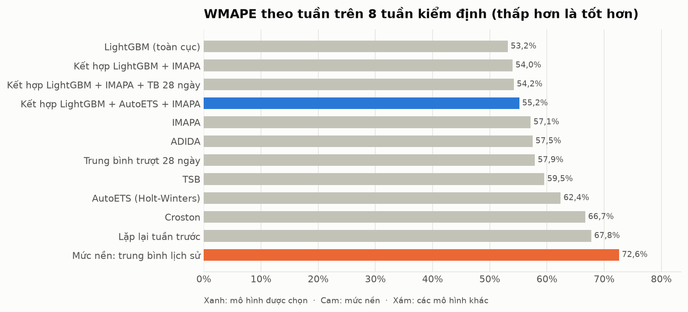
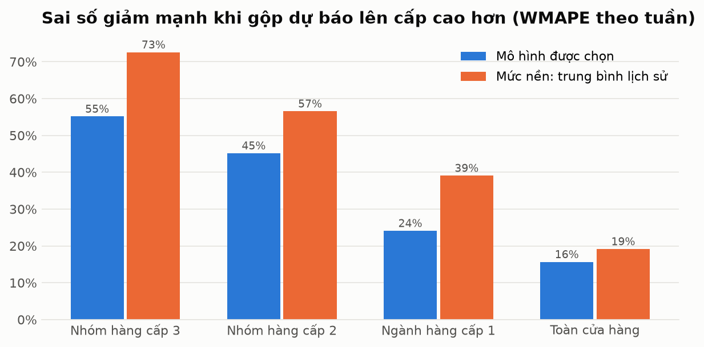
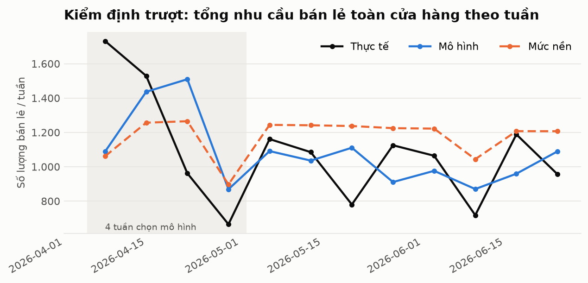
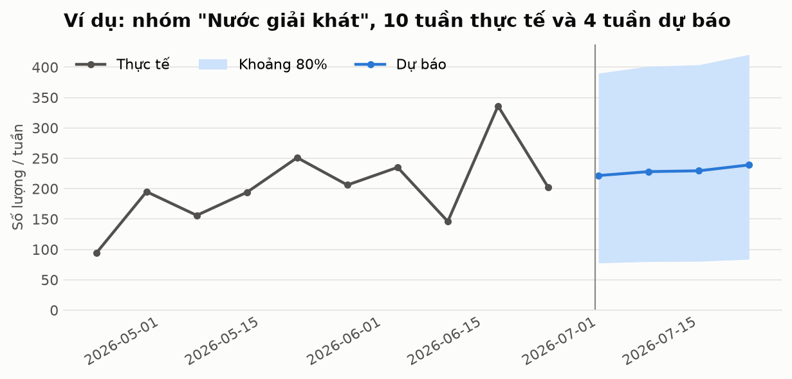
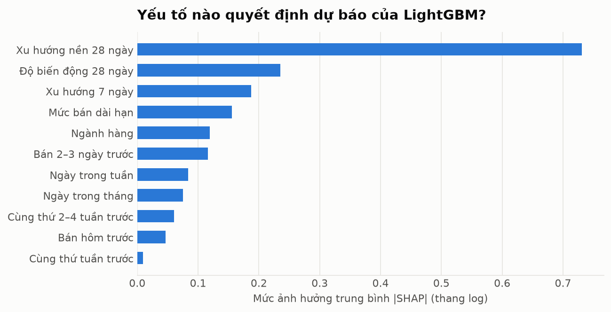

# Mô hình dự báo nhu cầu

_Sinh tự động bởi `python -m hasu.forecast_report` lúc 02/10/2026 10:46. Dữ liệu tới 30/06/2026._

## Kết quả chính

- **Mô hình được chọn:** Kết hợp LightGBM + AutoETS + IMAPA, chọn trên 4 tuần đầu của kiểm định, không nhìn vào 8 tuần dùng để chấm điểm.
- **Toàn cửa hàng:** sai số dự báo tuần (WMAPE) 15,7%, tức độ chính xác khoảng **84%**. Mức nền: 19,2%.
- **Nhóm hàng cấp 3** (đơn vị ra quyết định nhập hàng): WMAPE 55,2% so với 72,6% của mức nền, **giảm 24% sai số**. Độ lệch (bias) -0,4%, trong khi mức nền dự báo thừa 19,2%.
- **Mô phỏng nhập hàng 8 tuần:** so với nhập theo mức nền, nhập theo mô hình kết hợp phân vị giảm **11% lượng hàng thiếu** và giảm **20% giá trị hàng dư** cùng lúc.

**Nói thẳng về giới hạn:** chỉ 50% số nhóm hàng có sai số thấp hơn mức nền khi xét riêng từng nhóm, và mô hình chỉ tốt hơn trung bình trượt 28 ngày một chút (55,2% so với 57,9%). Với dữ liệu thưa như cửa hàng này, không mô hình nào dự báo chính xác từng nhóm hàng nhỏ theo tuần. Giá trị thực tế nằm ở: (1) dự báo tổng và nhóm lớn đáng tin cậy, (2) chính sách nhập hàng theo phân vị, (3) giải thích được và tự động hoá được.

## 1. Dữ liệu đầu vào và phân loại nhu cầu

- Mục tiêu: **số lượng bán lẻ** theo ngày của từng nhóm hàng cấp 3, đã loại đơn lớn, đơn tổ chức, xuất nội bộ, hàng trả, hàng tặng (xem báo cáo chất lượng dữ liệu).
- **Lớp ngày thường:** ngày đóng cửa và vùng ±14 ngày quanh Tết được thay bằng trung vị cùng thứ trong các tuần lân cận trước khi huấn luyện, để mô hình học đường nền không bị đột biến kéo lệch. **Lớp ngày lễ:** khi kỳ dự báo rơi vào vùng Tết, dự báo được nhân hệ số số lượng theo ngành hàng (đo từ Tết 2026, xem báo cáo phân tích kinh doanh).
- Phân loại kiểu nhu cầu theo **Syntetos–Boylan** (ADI: khoảng cách trung bình giữa hai ngày có bán; CV²: độ biến động lượng bán):

| Kiểu nhu cầu | Số nhóm hàng | Tỷ trọng số lượng |
|---|---|---|
| Chưa đủ dữ liệu (dưới 20 ngày có bán) | 77 | 2,7% |
| Lumpy: bán gián đoạn, lượng dao động | 70 | 39,2% |
| Intermittent: bán gián đoạn, lượng đều | 25 | 3,6% |
| Erratic: ngày nào cũng bán, lượng dao động | 10 | 54,5% |

Nhóm "chưa đủ dữ liệu" không được dự báo bằng mô hình: dùng trung bình 8 tuần gần nhất và gắn nhãn rõ trên ứng dụng (đề xuất nhập lô nhỏ thăm dò).

## 2. Phương pháp kiểm định

**Kiểm định trượt theo thời gian (walk-forward):** 12 tuần cuối được chia thành 12 cửa sổ. Ở mỗi cửa sổ, mô hình chỉ thấy dữ liệu tới trước tuần đó, dự báo 7 ngày, rồi so với thực tế. **4 tuần đầu** dùng để chọn mô hình, **8 tuần sau** dùng để báo cáo. Tách hai giai đoạn để con số báo cáo không bị "đẹp giả" do chọn mô hình trên chính dữ liệu chấm điểm.

| Chỉ số | Ý nghĩa |
|---|---|
| WMAPE | Tổng sai số tuyệt đối / tổng thực tế. Dùng được khi có nhiều tuần bán bằng 0 (MAPE thì không) |
| MAE | Sai số tuyệt đối trung bình, theo đơn vị sản phẩm |
| MdAPE | Trung vị sai số %, chỉ trên các tuần có bán |
| Bias | Sai số có dấu: dương là dự báo thừa (chôn vốn), âm là dự báo thiếu (mất doanh thu) |
| Tracking signal | Sai số tích luỹ / sai số trung bình. Lớn hơn 4 về trị tuyệt đối: mô hình lệch hệ thống |
| Fill rate, service level | Tỷ lệ nhu cầu được đáp ứng; tỷ lệ tuần không thiếu hàng (trong mô phỏng) |

## 3. So sánh mô hình

| Mô hình | WMAPE (4 tuần chọn) | WMAPE (8 tuần chấm) | MAE | MdAPE | Bias |
|---|---|---|---|---|---|
| LightGBM (toàn cục) | 67,7% | 53,2% | 5,11 | 53,6% | -6,0% |
| Kết hợp LightGBM + IMAPA | 66,6% | 54,0% | 5,19 | 54,6% | -3,0% |
| Kết hợp LightGBM + IMAPA + TB 28 ngày | 68,2% | 54,2% | 5,21 | 56,6% | -1,1% |
| Kết hợp LightGBM + AutoETS + IMAPA ✅ | 64,8% | 55,2% | 5,30 | 53,5% | -0,4% |
| IMAPA | 67,3% | 57,1% | 5,49 | 59,9% | 0,0% |
| ADIDA | 66,4% | 57,5% | 5,53 | 61,1% | 0,2% |
| Trung bình trượt 28 ngày | 72,3% | 57,9% | 5,57 | 60,0% | 2,6% |
| TSB | 69,5% | 59,5% | 5,73 | 68,3% | -2,6% |
| AutoETS (Holt-Winters) | 65,6% | 62,4% | 6,00 | 59,2% | 4,7% |
| Croston | 73,0% | 66,7% | 6,41 | 59,7% | 12,8% |
| Lặp lại tuần trước | 77,1% | 67,8% | 6,52 | 77,5% | -3,2% |
| Mức nền: trung bình lịch sử | 76,5% | 72,6% | 6,98 | 64,6% | 19,2% |

**Vì sao chọn mô hình kết hợp mà không chọn LightGBM** dù LightGBM có WMAPE thấp nhất trên 8 tuần chấm (53,2%)? Vì quyết định chọn chỉ được dựa trên 4 tuần đầu. Ở đó LightGBM đứng sau mô hình kết hợp. Thứ hạng thay đổi giữa hai giai đoạn cho thấy mô hình đơn lẻ không ổn định, trong khi mô hình kết hợp tốt đều ở cả hai giai đoạn và gần như không lệch. Chọn lại theo kết quả chấm điểm là gian lận dữ liệu kiểm tra.

**Theo kiểu nhu cầu (8 tuần chấm, WMAPE):**

| Mô hình | erratic | lumpy | intermittent |
|---|---|---|---|
| LightGBM (toàn cục) | 36,2% | 70,4% | 99,7% |
| Kết hợp LightGBM + IMAPA + TB 28 ngày | 36,9% | 72,7% | 90,5% |
| Kết hợp LightGBM + IMAPA | 37,4% | 71,4% | 93,5% |
| Kết hợp LightGBM + AutoETS + IMAPA | 38,2% | 73,2% | 93,4% |
| Trung bình trượt 28 ngày | 38,8% | 79,2% | 87,6% |
| Croston | 39,4% | 86,9% | 243,1% |
| IMAPA | 39,7% | 76,0% | 91,8% |
| ADIDA | 39,7% | 76,7% | 93,8% |
| TSB | 41,6% | 78,6% | 99,7% |
| AutoETS (Holt-Winters) | 43,6% | 82,9% | 95,7% |
| Mức nền: trung bình lịch sử | 49,4% | 95,9% | 141,4% |
| Lặp lại tuần trước | 50,1% | 86,4% | 107,8% |

Nhóm erratic (bán hằng ngày, chiếm phần lớn sản lượng) dự báo khá tốt. Nhóm lumpy và intermittent rất khó dự báo theo tuần, đúng với lý thuyết: lượng bán của chúng gần như ngẫu nhiên.

## 4. Dự báo phân tầng: sai số theo cấp gộp

| Cấp | Mô hình | Trung bình 28 ngày | Mức nền |
|---|---|---|---|
| Nhóm hàng cấp 3 | 55,2% | 57,9% | 72,6% |
| Nhóm hàng cấp 2 | 45,2% | 46,5% | 56,6% |
| Ngành hàng cấp 1 | 24,1% | 24,8% | 39,1% |
| Toàn cửa hàng | 15,7% | 13,2% | 19,2% |

Dự báo cấp nhóm hàng 3 được cộng lên các cấp trên (bottom-up), nên luôn khớp nhau. Sai số giảm mạnh khi gộp vì dao động ngẫu nhiên của các nhóm nhỏ triệt tiêu lẫn nhau. Đây là lý do ứng dụng hiển thị nhãn độ tin cậy cho từng dòng và khuyến nghị dùng dự báo ngành hàng cho kế hoạch vốn.

## 5. Từ dự báo tới số lượng nhập

Dự báo điểm là mức trung tâm. Nhập đúng bằng dự báo điểm thì khoảng một nửa số tuần sẽ thiếu hàng. Vì vậy số lượng đề xuất nhập = dự báo × hệ số phân vị τ, với τ chọn theo đặc điểm nhóm hàng. Đây là mắt xích nối phân tích biên lợi nhuận với mô hình:

| Loại nhóm hàng | Phân vị τ | Lý do |
|---|---|---|
| Ngôi sao | 0,80 | Biên cao, bán chạy: chi phí hết hàng cao hơn chi phí tồn dư |
| Dễ hư hỏng | 0,55 | Hạn dùng ngắn: hàng dư gây lỗ trực tiếp, cần cân bằng |
| Bảo quản lâu | 0,70 | Biên thấp, để được lâu: rủi ro tồn dư chủ yếu là chi phí vốn |

Hệ số phân vị được ước lượng bằng **conformal prediction** theo tỷ lệ: từ các tuần đã kiểm định, lấy phân vị τ của tỷ lệ thực tế/dự báo cho từng kiểu nhu cầu. Phương pháp này không giả định phân phối chuẩn, phù hợp với nhu cầu gián đoạn.

**Mô phỏng nhập hàng trên 8 tuần chấm điểm** (hệ số phân vị ước lượng trên 4 tuần chọn, không nhìn trước):

| Cách nhập | Tổng nhập | Hàng thiếu | Hàng dư | Fill rate | Giá trị hàng dư |
|---|---|---|---|---|---|
| Mức nền: trung bình lịch sử | 9.627 | 2.157 | 3.707 | 73,3% | 58,1 triệu đ |
| Trung bình 28 ngày (cách nhẩm) | 8.285 | 2.234 | 2.442 | 72,3% | 37,2 triệu đ |
| Mô hình: dự báo điểm | 8.043 | 2.245 | 2.211 | 72,2% | 35,9 triệu đ |
| Mô hình + phân vị theo nhóm hàng | 9.342 | 1.910 | 3.174 | 76,4% | 46,7 triệu đ |

- So với **mức nền**: hàng thiếu giảm 11%, giá trị hàng dư giảm 20%: tốt hơn ở cả hai mặt.
- So với **trung bình 28 ngày**: hàng thiếu giảm 15% nhưng hàng dư tăng 26%. Đây là đánh đổi có chủ đích: nhóm ngôi sao được ưu tiên đủ hàng.
- **Giả định của mô phỏng:** hàng không mang sang tuần sau, nhập đầu tuần và có hàng ngay. Chưa có dữ liệu tồn kho và thời gian giao hàng thực tế, nên đây là so sánh tương đối giữa các cách nhập, không phải con số tiết kiệm thật.

## 6. Giải thích dự báo bằng SHAP

SHAP phân rã mỗi dự báo của LightGBM thành đóng góp của từng yếu tố. LightGBM dùng hàm mục tiêu Tweedie (hợp với số đếm nhiều số 0), nên dự báo nằm trên thang log. Vì vậy trong ứng dụng, đóng góp được đổi thành **% tác động**, ví dụ "ngày Chủ nhật làm dự báo giảm 12%".

- Ba yếu tố quan trọng nhất: **Xu hướng nền 28 ngày**, **Độ biến động 28 ngày**, **Xu hướng 7 ngày**. Mô hình dựa chủ yếu vào mức bán gần đây, tức hành vi giống một trung bình trượt thông minh, cộng thêm hiệu chỉnh theo ngày trong tuần và ngành hàng.
- **Khuyến mãi không được đưa vào mô hình chính.** Giá bán trong dữ liệu chỉ quan sát được ở ngày có bán, nên dùng nó làm biến dự báo sẽ làm rò rỉ thông tin "hôm đó có bán". Ảnh hưởng của giảm giá được ước lượng riêng cho phần kịch bản (mục 7).

## 7. Kịch bản mô phỏng: giảm giá

Ước lượng sơ bộ: trong các ngày có bán, lượng bán ngày có chiết khấu trên 5% so với ngày bình thường (đã chuẩn hoá theo mức bán của từng nhóm hàng).

| Ngành hàng | Số ngày có chiết khấu | Chiết khấu TB | Lượng bán / ngày thường | Đủ tin cậy (≥ 30 ngày) |
|---|---|---|---|---|
| Đồ uống | 98 | 13,7% | 1,84 lần | Có |
| Sữa, sản phẩm từ sữa | 94 | 19,8% | 1,91 lần | Có |
| Gạo, bột và thực phẩm khô | 86 | 16,2% | 1,88 lần | Có |
| Bánh, kẹo, snack | 78 | 14,2% | 1,63 lần | Có |
| Chăm sóc cá nhân | 65 | 14,6% | 2,19 lần | Có |
| Thực phẩm đông mát | 64 | 16,5% | 1,34 lần | Có |
| Dầu ăn, nước chấm, gia vị | 56 | 21,2% | 1,68 lần | Có |
| Chăm sóc nhà cửa | 46 | 20,4% | 0,99 lần | Có |
| Nhà cửa và đời sống | 13 | 15,6% | 1,14 lần | Không |
| Rau, củ, trái cây | 4 | 17,5% | 0,70 lần | Không |
| Thịt, trứng, thủy hải sản tươi | 3 | 10,7% | 0,79 lần | Không |
| Dụng cụ bảo hộ | 1 | 21,1% | 0,63 lần | Không |

**Cảnh báo quan trọng:** con số này **có thể bị phóng đại**. Ở cửa hàng tạp hoá, giá thấp hơn giá phổ biến thường do khách **mua theo thùng hoặc lốc** (giá sỉ). Khi đó mua nhiều mới được giá thấp, chứ không phải giá thấp khiến khách mua nhiều. Dữ liệu hiện tại chưa tách được hai hiệu ứng này. Ứng dụng hiển thị kết quả kịch bản kèm cảnh báo, và nên coi đó là **mức trần**.

## 8. Vòng lặp cải thiện tự động

Mỗi lần chạy dự báo, hệ thống lưu **snapshot** (bảng `fc_snapshots`). Khi cửa hàng nạp file KiotViet mới trên ứng dụng: dữ liệu được ghép và khử trùng lặp, snapshot cũ được đối chiếu với thực tế, tính WMAPE, Bias và tracking signal. Nếu sai số vượt **1,3 lần** sai số kiểm định, hoặc tracking signal vượt 4, hệ thống cảnh báo suy giảm chất lượng và chạy lại mô hình. Trang "Lịch sử và đánh giá" hiện 8 tuần kiểm định được ghi lại theo đúng cơ chế này để minh hoạ.

## 9. Giới hạn

| Giới hạn | Hướng xử lý |
|---|---|
| 10 tháng dữ liệu, chỉ một kỳ Tết | Dự báo 7–28 ngày; hệ số Tết cập nhật qua vòng lặp |
| Không có tồn kho, thời gian giao hàng | Mô phỏng chỉ so sánh tương đối; cần dữ liệu tồn kho để tính tồn kho an toàn |
| Hết hàng chỉ suy đoán từ dữ liệu bán | Ứng dụng có danh sách để chủ cửa hàng xác nhận |
| Dữ liệu rất thưa ở cấp nhóm nhỏ | Nhãn độ tin cậy; khuyến nghị dùng dự báo cấp cao hơn |
| Chưa thử được Chronos (mạng chặn Hugging Face) | Code đã sẵn sàng, tự chạy khi tải được mô hình |
